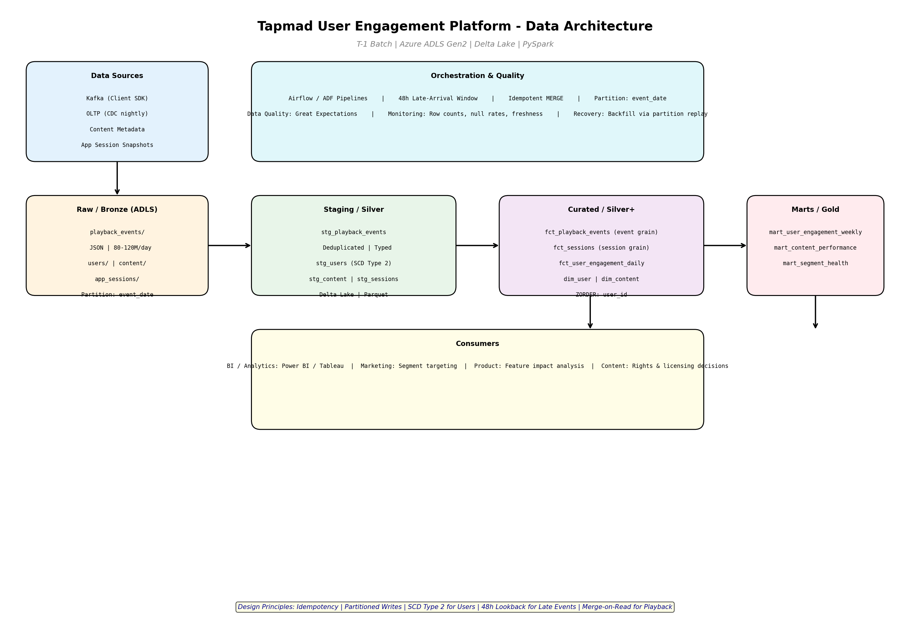
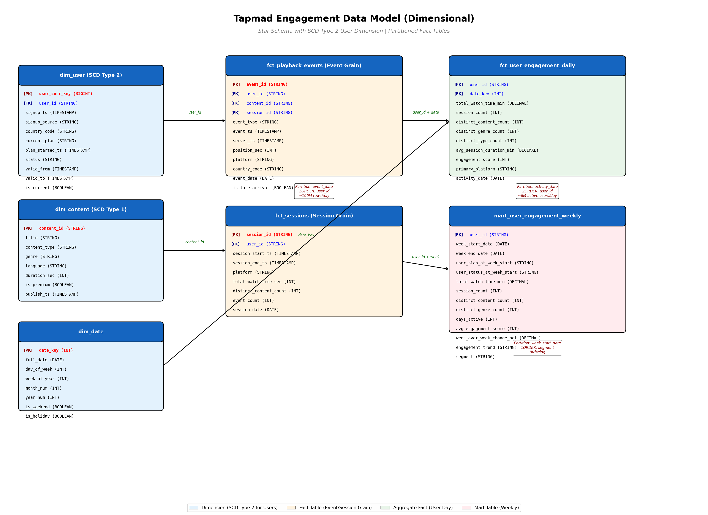

This is a production-oriented data platform design that directly addresses the business question: *"How engaged are our users this week compared to last week, and which segments are gaining or losing engagement the fastest?"*

---

## Deliverables Overview

| Deliverable | File | Description |
|-------------|------|-------------|
| **README** | [README.md](./README.md) | Problem interpretation, engagement definition, architecture decisions, trade-offs, assumptions |
| **Architecture Diagram** | [architecture_diagram.png](./architecture_diagram.png) | End-to-end data flow: Sources → Bronze → Silver → Curated → Marts → Consumers |
| **Data Model ERD** | [data_model_erd.png](./data_model_erd.png) | Dimensional star schema with SCD Type 2 user dimension, event/session/user-day facts, and weekly mart |
| **DDL** | [create_tables.sql](./create_tables.sql) | Delta Lake table definitions with partitioning, Z-ORDER, and optimization |
| **ETL: Bronze→Silver** | [bronze_to_silver.py](./bronze_to_silver.py) | Deduplication (event_id + server_ts), late-arrival flagging, idempotent MERGE |
| **ETL: SCD Type 2 Users** | [dim_user_scd2.py](./dim_user_scd2.py) | CDC snapshot → slowly-changing dimension with hash-based change detection |
| **ETL: Silver→Curated** | [silver_to_curated.py](./silver_to_curated.py) | Heartbeat-based watch time calculation, session reconstruction, out-of-order handling |
| **ETL: Curated→Marts** | [curated_to_marts.py](./curated_to_marts.py) | User-day aggregates, 0-100 engagement score (percentile-based), weekly mart with WoW change |
| **Analytics: Weekly Report** | [weekly_engagement.sql](./weekly_engagement.sql) | 3 BI-ready queries: Executive Summary, Segment Velocity, At-Risk Users |
| **Analytics: Engagement Score** | [engagement_score.sql](./engagement_score.sql) | Score definition, daily computation, and backfill strategy |
| **Orchestration** | [airflow_dag.py](./airflow_dag.py) | Airflow DAG with 7 tasks, dependencies, retries, and alerts |
| **Sample Output** | [weekly_report_executive_summary.csv](./weekly_report_executive_summary.csv) | Sample BI output (24 segment×plan combinations) |
| | [weekly_report_segment_velocity.csv](./weekly_report_segment_velocity.csv) | Fastest-changing segments |
| | [weekly_report_at_risk_users.csv](./weekly_report_at_risk_users.csv) | Top 100 at-risk users for Marketing action |

---

## Key Design Decisions

### 1. Engagement Definition
- **"A view" = heartbeat-derived watch time**, not event count. This prevents inflation from users who tap play repeatedly without watching.
- **Primary metric: Weekly Active Watch Time (minutes)** — closest to business value (ad impressions, retention).
- **Engagement Score (0–100):** `(WatchTimePctile × 0.50) + (FrequencyPctile × 0.30) + (BreadthPctile × 0.20)`, computed within plan segment to avoid penalizing basic users.

### 2. Data Quality Handling
| Issue | Solution |
|-------|----------|
| **Duplicates** | Deduplicate on `event_id`, keeping latest `server_ts` |
| **Out-of-order events** | Re-order within `session_id` + `content_id` by `server_ts` |
| **Late arrivals (48h)** | 2-day lookback window; MERGE into `fct_playback_events` by `event_id` |
| **Client clock skew** | Use `server_ts` as authoritative ordering; `event_ts` for latency metrics only |

### 3. SCD Type 2 for Users
**Why:** If a user upgrades from `basic` to `premium` mid-week, their pre-upgrade watch time must be attributed to `basic` and post-upgrade to `premium`. Type 1 would force arbitrary allocation and break week-over-week comparisons. This is the single most important modeling decision for answering the segment velocity question.

### 4. Partitioning & Z-ORDER Strategy
| Table | Partition By | Z-Order By | Rationale |
|-------|-------------|-----------|-----------|
| `fct_playback_events` | `event_date` | `user_id`, `content_id` | Time-travel + user joins at 100M rows/day |
| `fct_sessions` | `session_date` | `user_id` | User aggregation |
| `fct_user_engagement_daily` | `activity_date` | `user_id` | Time-series lookup |
| `mart_user_engagement_weekly` | `week_start_date` | `segment`, `plan` | BI filter patterns |

**Why not partition by `user_id`?** 6M users × 365 days = 2.1B partitions, overwhelming the metastore. Date partitioning keeps partition count manageable (~730 for 2 years). Z-ORDER on `user_id` achieves query pruning without metastore explosion.

### 5. Idempotency & Recovery
- All writes use Delta `MERGE` on natural keys. Re-running a day's pipeline produces byte-identical output.
- Recovery is partition-level: drop `event_date=2024-01-15` and replay only that partition.
- The 48h lookback ensures late heartbeats are incorporated without full reprocessing.

---

## Architecture Diagram

## Data Model (Dimensional Star Schema)

---

## Weekly Engagement Report (Sample SQL Output)

The `mart_user_engagement_weekly` table is designed for direct BI consumption. A single query with `GROUP BY segment, plan` answers the leadership question with these columns:

| Column | Purpose |
|--------|---------|
| `week_start_date` | Reporting period |
| `segment` | Power User / Regular / Casual / Dormant (derived from days_active) |
| `plan` | User's plan at week start (historically accurate via SCD2) |
| `total_users` | Segment population |
| `avg_watch_time_min` | Average weekly watch time |
| `avg_sessions` | Average session frequency |
| `avg_engagement_score` | Composite 0-100 score |
| `avg_wow_change_pct` | Week-over-week watch time change |
| `surging_users` | Count in "Surging" trend |
| `at_risk_users` | Count in "At Risk" trend |
| `engagement_score_delta` | Score change vs prior week |

---

## Extended Architecture (Phase 2)
In addition to the core PySpark pipeline, this repository contains a **Phase 2** architecture demonstrating how I would scale this platform in production:

1. **Infrastructure as Code:** The `terraform/` folder contains definitions for provisioning the ADLS Gen2 Data Lake, Event Hubs, and Databricks/Fabric workspaces.
2. **Analytics Engineering:** The `dbt/` folder refactors the SQL transformations into a proper semantic layer with built-in tests (`schema.yml`) ensuring the engagement score never breaks the 0-100 bounds.
3. **CI/CD:** The `.github/workflows/` directory contains a GitHub Action to deploy Terraform and test dbt models on merge.
4. **Real-Time Streaming:** The `streaming/` folder contains Kusto (KQL) scripts to run sub-second engagement dashboards for live sports using Azure Eventhouse.
5. **Great Expectations:** The `data_quality/` folder contains placeholder YAML suites for enforcing strict schema contracts.

---

This submission demonstrates the engineering judgment, trade-off analysis, and operational thinking expected for a Lead Data Engineer role. All code is Spark/Delta Lake compatible with Azure Fabric/Databricks and ready for the technical interview walkthrough.